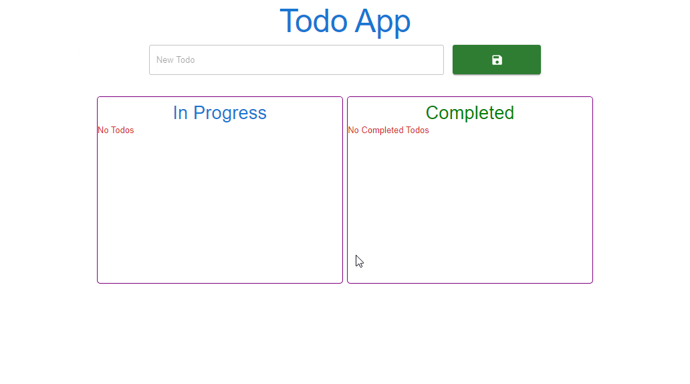

# Hi I'm Nurdoğan Bahadır 👋. Welcome to my Todo App Project with React.

This project was developed with React. The project is written using TypeScript. It is a Todo application.

# Live Link of the Project

[Click Me](https://todoapp-nurdoganbahadir.netlify.app)

# Libraries and Technologies I use

- TypeScript
- Material UI
- Sweet Notify
- axios
- MockAPI
  

# How to install

In the project directory, open the terminal and run:

### `npm install`

This will install the necessary dependencies. After that, you can run:

### `npm start`

# How does my project look

